## 개발 환경 설정 : 맥 OS

맥 OS에는 기본적으로 파이썬 2.7버전이 설치되어있기 때문에 3.5 버전을 새로 설치를 해야 합니다.

### 1. 파이썬 3.5 설치 및 환경 설정

파이썬 다운로드 페이지[[Link]](https://www.python.org/downloads/release/python-350/)로 접속하면 다음과 같은 화면이 나옵니다.

   
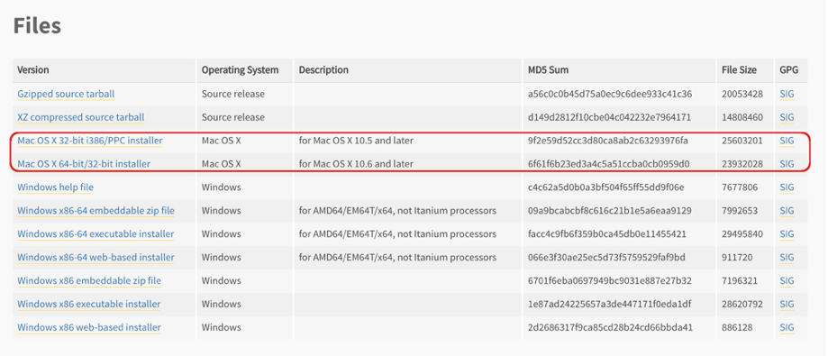

1. 위 화면에서 자신의 맥 OS 버전에 맞는 파일을 선택해서 다운로드합니다. 다운로드가 완료된 파일을 실행 후 안내에 따르면 설치가 완료됩니다.

   ​

   
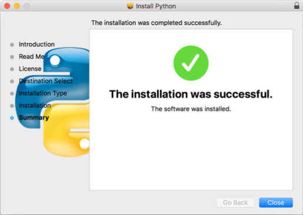

   0383

   ​

2. 파이썬 설치가 정상적으로 완료됐는지 확인하기 위해서는 터미널을 실행합니다. 터미널 창에 ‘python3’ 명령어를 입력했을 때 다음 화면과 같이 출력된다면 정상적으로 설치된 것입니다.

   ​

   
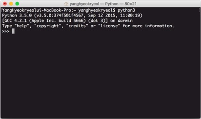

   ​

### 2. 파이참 커뮤니티 설치 및 환경 설정

파이참의 설치 및 환경 설정은 다음과 같은 순서로 진행합니다.

1. 파이참 홈페이지[[Link]](https://www.jetbrains.com/pycharm/)에 접속하여 커뮤니티버전을 다운로드합니다.

2. 다운로드가 완료된 파일을 실행하고아래 그림에서 왼쪽 PyCharm CE 아이콘을 오른쪽 폴더 아이콘으로 드래그하면 설치가 완료됩니다.

   
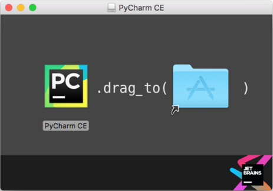

3. 처음 파이참을 실행하게 되면 설정화면이 나오는데 IDE theme을 통해 IDE의 색상과 스타일을 변경할 수 있습니다. Default는 우분투의 개발환경설정에서 봤던 Intellij 테마입니다. 이 책에서는 Default를 사용할 것입니다.
   ​

4. 초기 설정을 완료하고 Create New Project 버튼을 클릭합니다.

   ​

5. Create New Project 버튼을 클릭하면 아래 그림과 같은 화면이 나옵니다. Location은 프로젝트가 생성될 경로와 프로젝트 폴더명을 설정하는 곳입니다. 프로젝트의 이름과 경로는 임의로 지정하면 됩니다.

   Interpreter는 프로젝트에서 어떤 파이썬 Interpreter를 사용할 것인지 고르는 것입니다. 우분투에서와 마찬가지로 VirtualEnv를 통해 가상 환경을 만들고 그것을 Interpreter로 사용할 것입니다. Create VirtualEnv 버튼을 누릅니다.

   ​

   
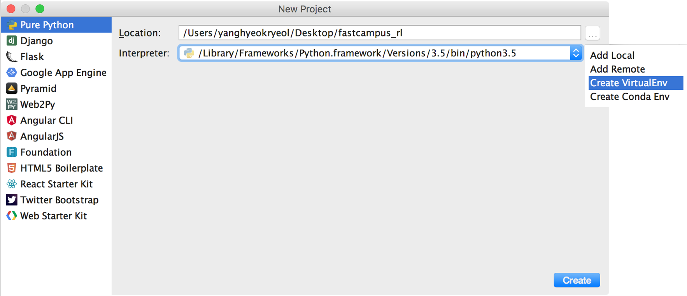

   ​

6. 아래 그림은 VirtualEnv의 생성화면입니다. Name과 Location은 여러분이 임의로 설정하면 됩니다. Base Interpreter는 위와 같이 새로 설치한 python3.5 를 선택합니다. OK버튼을 누르면 해당 VirtualEnv가 생성됩니다.

   ​

   
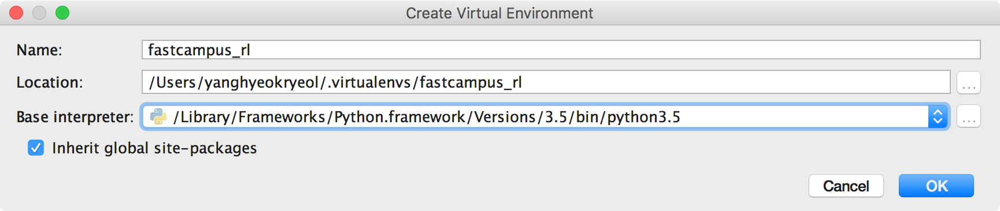

   ​

7. 처음 New Project 생성화면의 Interpreter에서 방금 생성한 VirtualEnv를 선택해줍니다. 그리고 Create버튼을 누르면 프로젝트 생성이 완료됩니다.

   ​

   
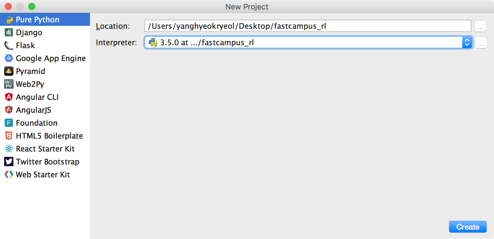

   ​

8. 프로젝트를 생성하고 나면 다음과 같은 작업 환경이 보입니다. 이 화면에서 최상위 폴더를 우클릭한 후

   New -> Python File을 클릭하면 새로운 파이썬 파일을 생성할 수 있습니다.

   ​

   
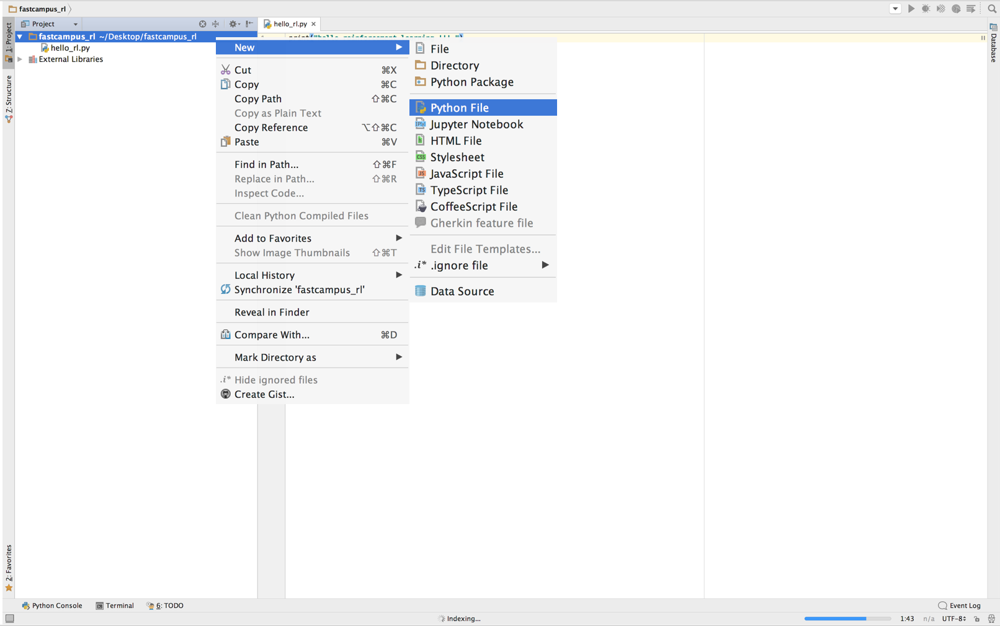

   ​

 9. 파이참이 제대로 설치됐는지 확인하기 위해 hello world 예제를 실행해봅니다.

 
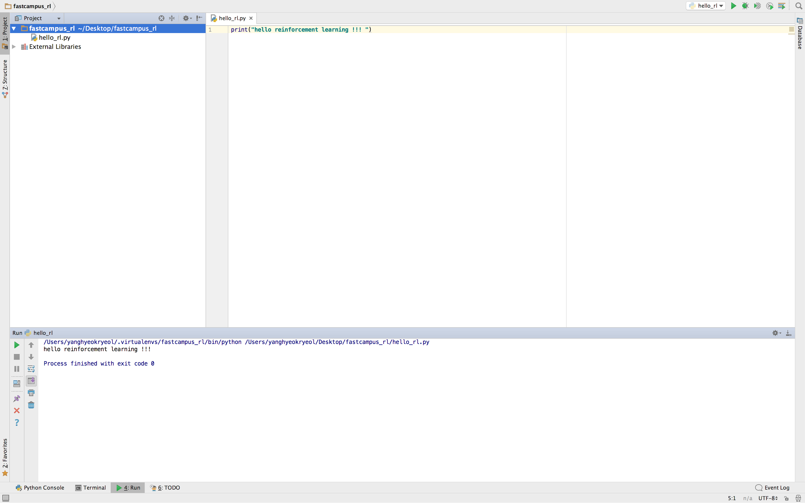

 ​
 ## 4. Numpy, Pillow 설치

 파이참에서 preference를 엽니다.

  
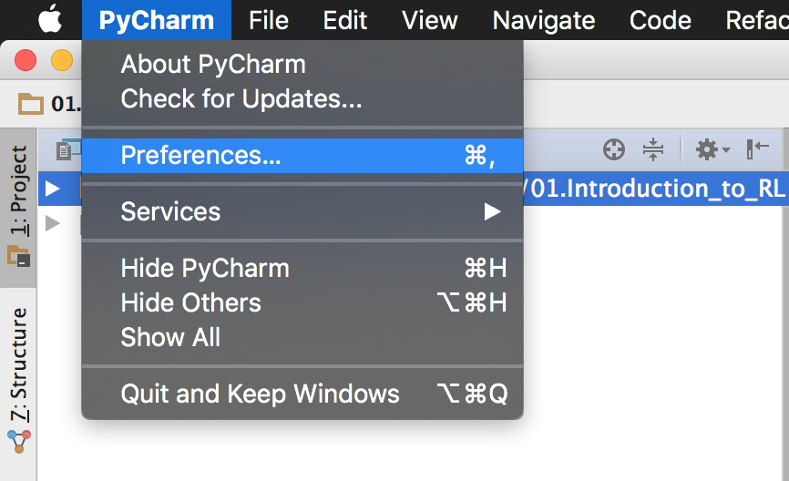

다음과 같이 인터프리터 설정에서 방금 만든 fastcampus_rl VirtualEnv가 설정되어있는지 확인합니다.

  

밑의 + 모양을 눌러 앞으로 필요한 라이브러리를 설치해보겠습니다.

  
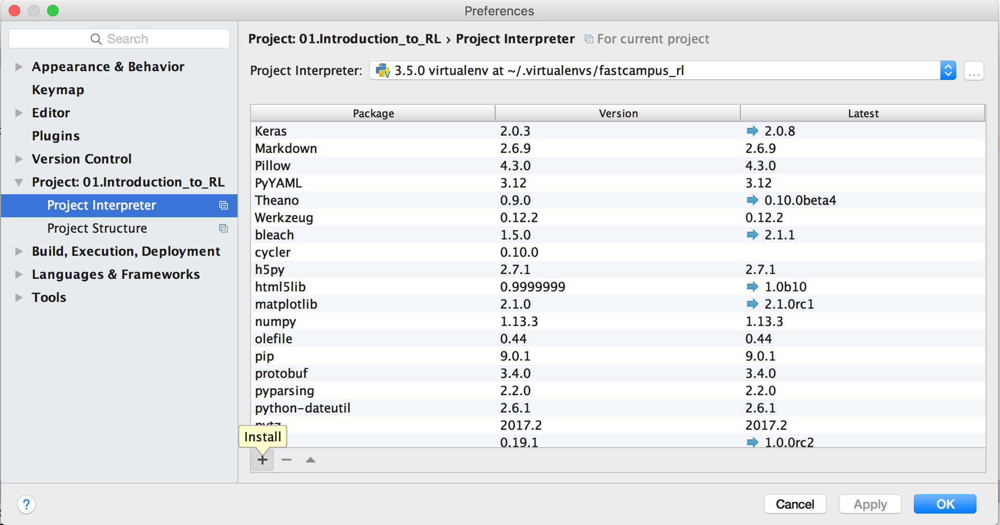

 - **Pillow** : 파이썬 이미지 라이브러리 입니다.

   다음과 같이 검삭창에 pillow 를 검색하여 아래의 install package를 클릭합니다.

   
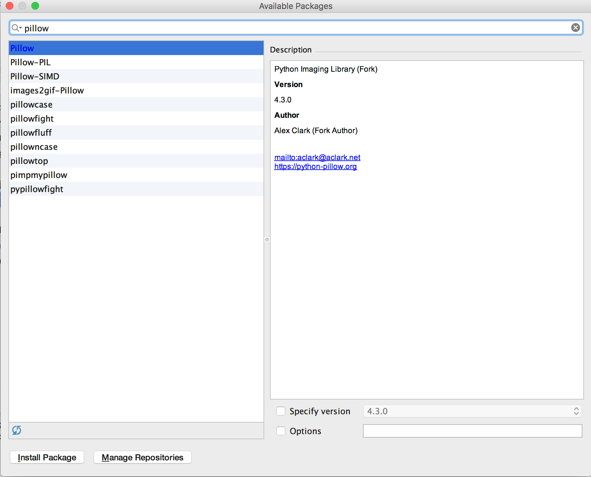

 - **Numpy** : 파이썬

   Numpy도 pillow와 같이 설치합니다.

   

 ### 5. Tensorflow, Keras, Matplotlib, h5py 설치

 실습 예제를 실행하기 위해 다음 라이브러리들을 설치해야합니다.

 Numpy, Pillow와 설치 방법은 같습니다.

 - **tensorflow** : 딥러닝 오픈소스 프레임워크

   
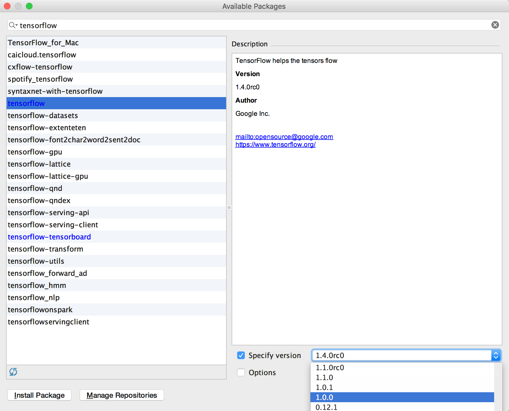
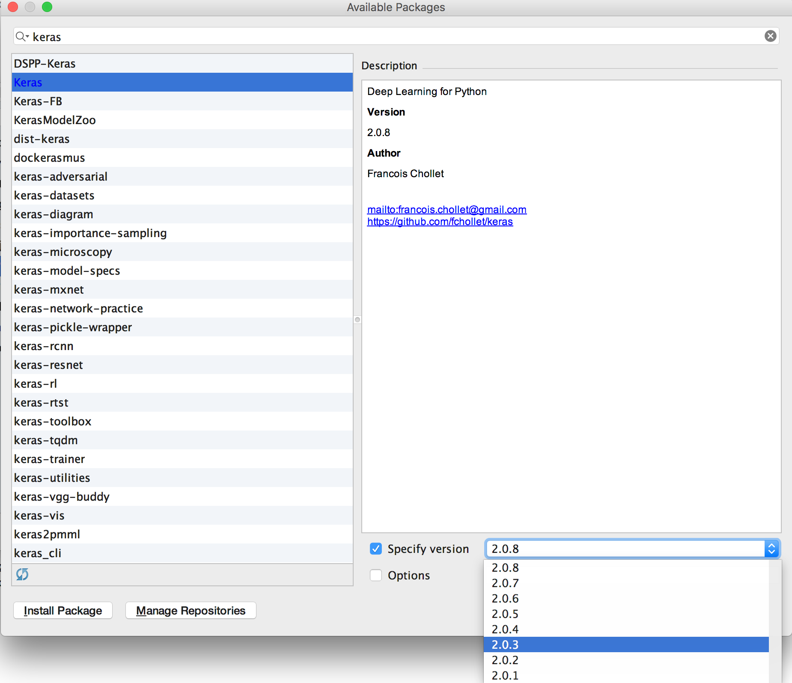

   버전을 2.0.3 으로 설치해줍니다.
   ​

 - **Matplotlib** : 파이썬 2-D plotting 라이브러리(에이전트의 리워드를 그래프로 시각화하기 위한 용도)

     
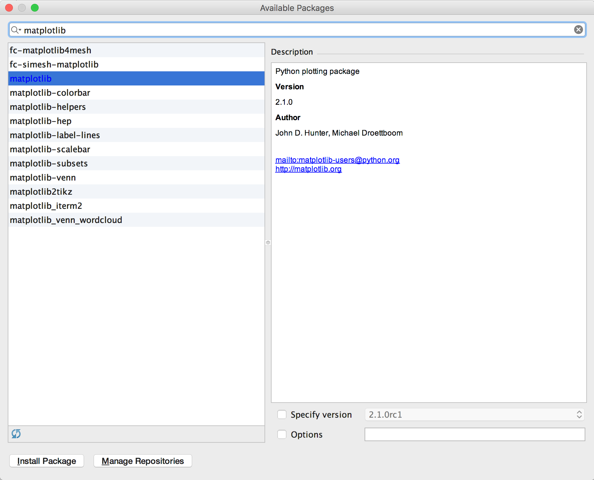

   ​

 - **h5py** : HDF5 바이너리 데이터 포맷의 형식을 저장하고 불러 올 수 있게하는 파이썬 라이브러리 입니다.
   ​            (튜토리얼에서 학습된 에이전트 모델을 저장하고 불러오는 역할을 합니다.)

    
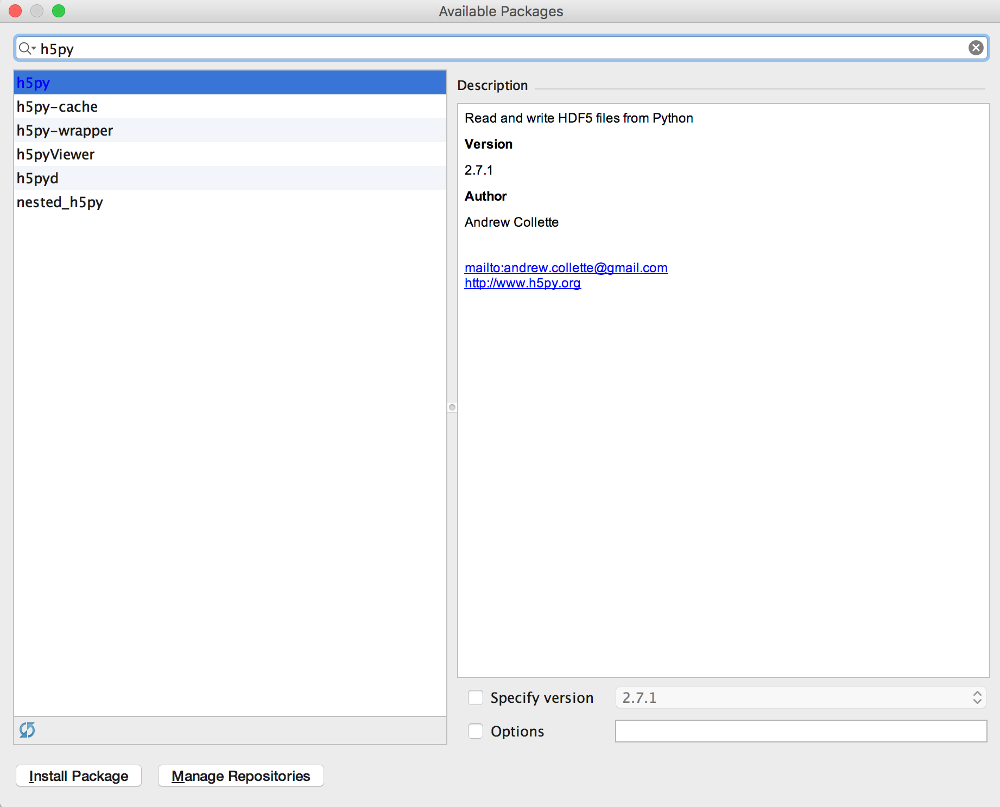

혹시 설치 도중 에러가 난다면 pip 와 wheel의 버젼이 최신인지 확인합니다.

  

### 6. 테스트 코드 실행

강의자료 dropbox에 01.Introduction_to_RL/setting_guide/testcode를 다운받아 
다음과 같이 파이참으로 실행합니다. 
이 코드는 수업에서 사용되는 코드는 아니지만 라이브러리들이 잘 설치되어있는 지 확인하기에 충분합니다.

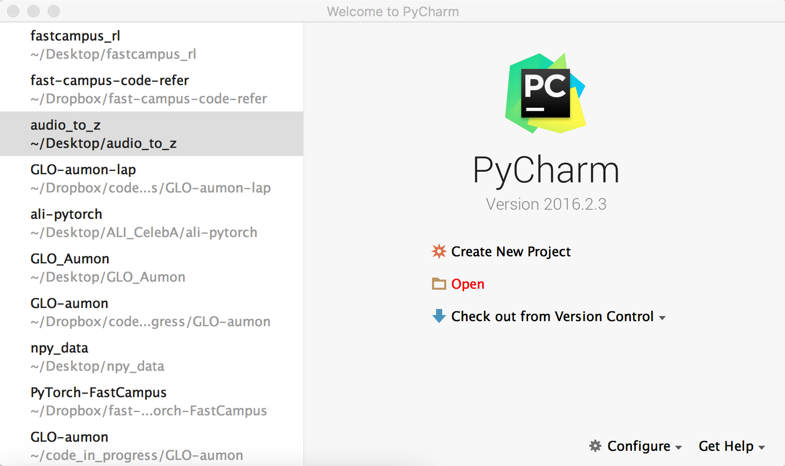

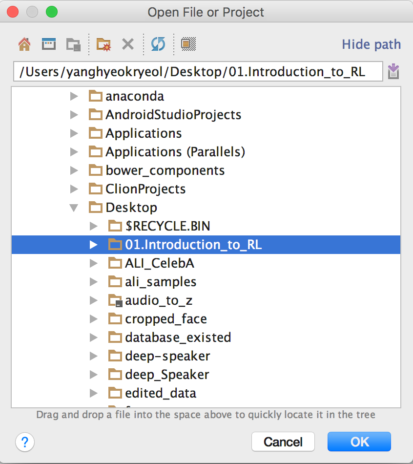

프로젝트를 열고 나서는 deep_sarsa 폴더 안의 deep_sarsa_agent.py 파일을 연 후 오른쪽 클릭 후 Run을 클릭해서 실행합니다.

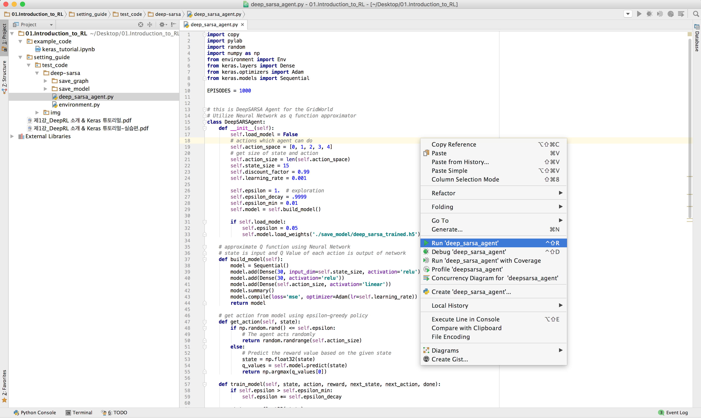

딥살사 실행화면 입니다.

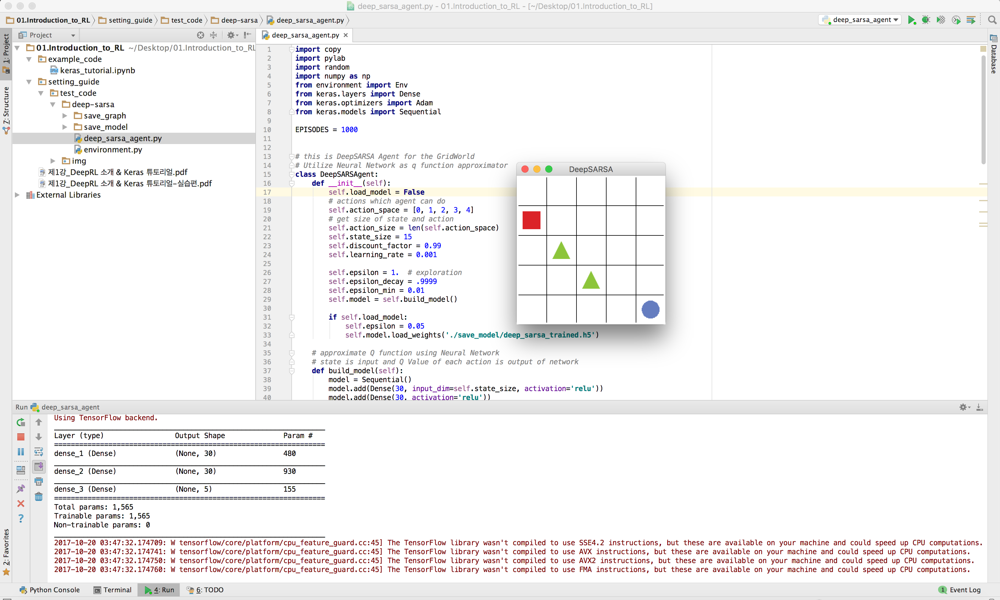

