## 3. 윈도우 설치(윈도우 10 권장)

### 1. 파이썬 설치

- 파이썬은 공식 홈페이지[[link]](https://www.python.org/downloads/windows/)에서 다운로드 할 수 있습니다. 3.5버전의 64bit 설치를 권장합니다.

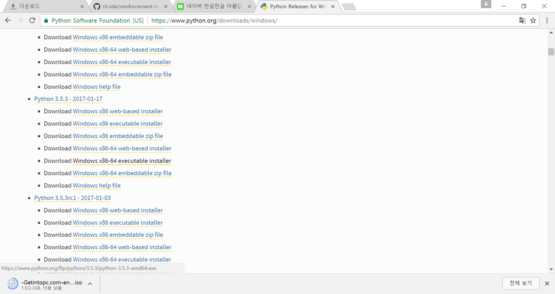

- 파이썬 인스톨러 실행 화면입니다.

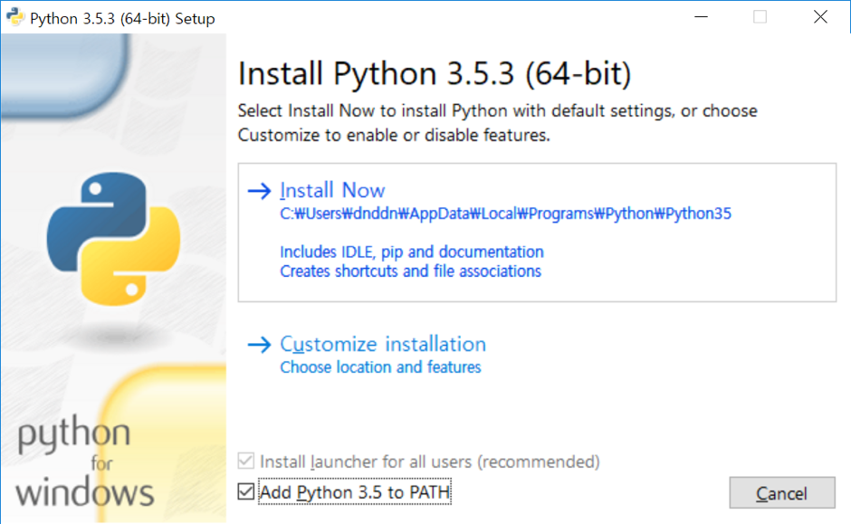


### 2. Numpy, spicy 설치

- Numpy, scipy는 바이너리 파일을 다운로드하여 pip (파이썬 패키지 관리자)를 이용해 설치합니다. 바이너리 파일은 다음 링크에서 다운로드 할 수 있습니다.

  링크 : [http://www.lfd.uci.edu/~gohlke/pythonlibs/](http://www.lfd.uci.edu/~gohlke/pythonlibs/)

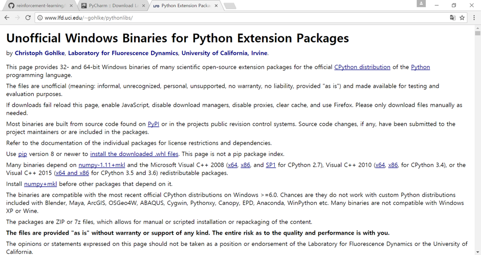

- 바이너리 파일(확장자 whl)을 윈도우 명령어창(cmd)에서 pip를 통해 설치합니다.

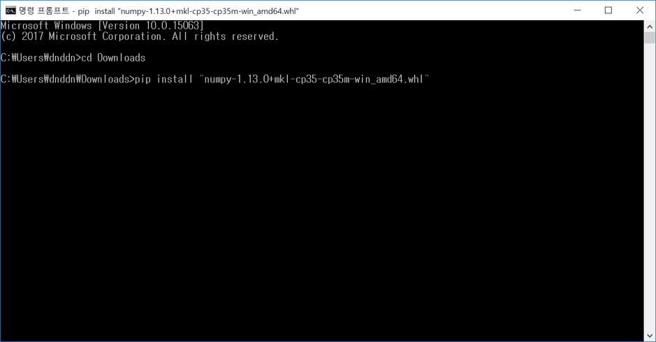


### 3. 파이참 설치

- 파이썬을 좀 더 편리하게 사용하기 위해 IDE(interface development environment)사용을 권장합니다. 파이참은 공식 홈페이지에서 다운로드하여 설치할 수 있습니다. [[link](https://www.jetbrains.com/pycharm/download/#section=windows)]

- 파이참 설치 화면 입니다.

   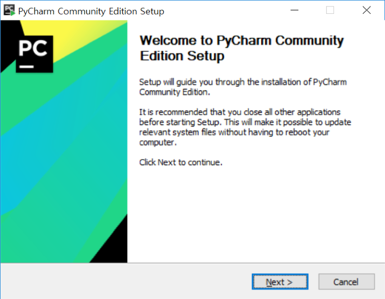


## 4. Numpy, Pillow 설치

터미널에서 다음 명령어를 실행하여 설치합니다.

- **Pillow** : 파이썬 이미지 라이브러리 입니다.

  명령어 프롬프트(cmd)창에서 다음 명령어를 실행하여 설치합니다.

  ```shell
  $ pip install Pillow
  ```

  <p align="center">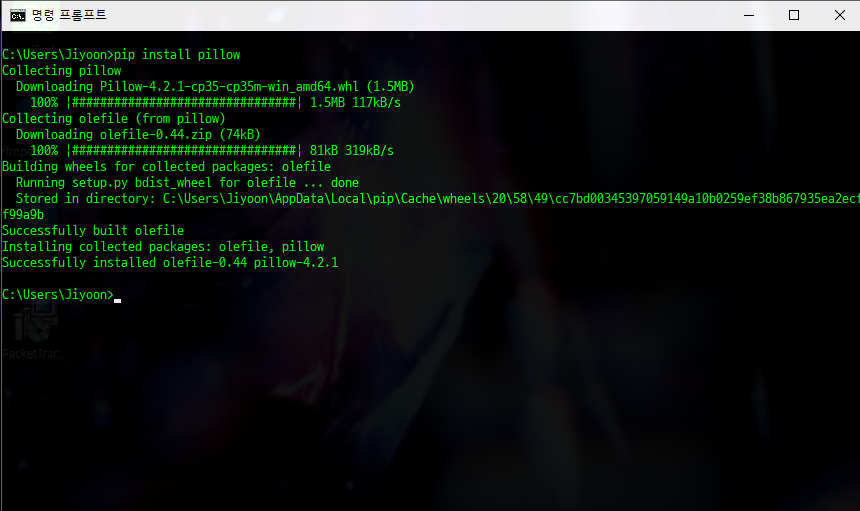


- **Numpy** : 파이썬

  Numpy도 pillow와 같이 명령어 프롬프트창(cmd)에서 다음 명령어로 설치합니다.

  ```shell
  $ pip install numpy
  ```

  <p align="center">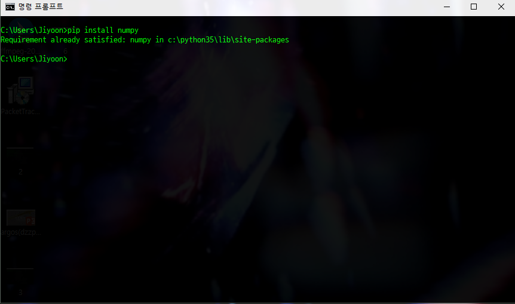


### 5. Tensorflow, Keras, Matplotlib, h5py 설치

실습 예제를 실행하기 위해 다음 라이브러리들을 설치해야합니다.

Numpy, Pillow와 설치 방법은 같습니다.

명령어 프롬프트창(cmd)에서 다음 명령어를 실행하여 설치합니다.

- **tensorflow** : 딥러닝 오픈소스 프레임워크

  ```shell
  $ pip install tensorflow==1.0.0
  ```

  <p align="center">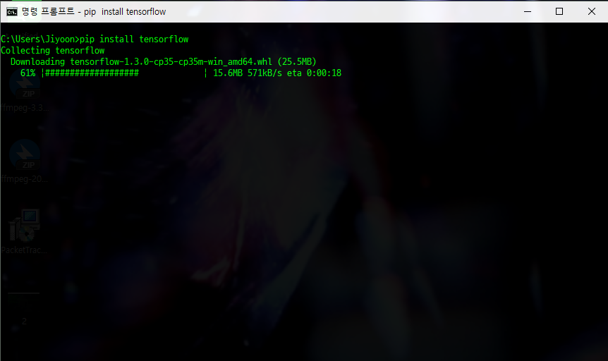</p

  ​


- **Keras** : tensorflow wrapper모듈(이 튜토리얼에서 Keras는 tensorflow를 backend로 사용합니다.)

  ```shell
  $ pip install keras==2.0.3
  ```

  <p align="center">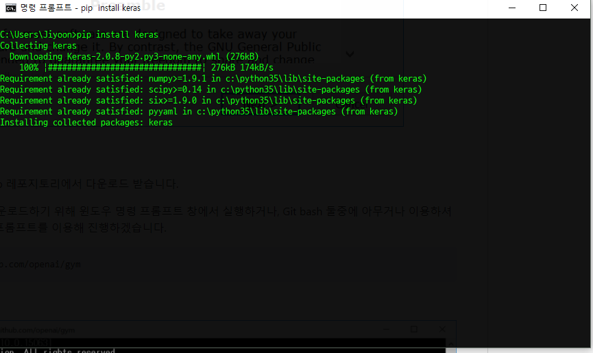</p>

  ​

- **Matplotlib** : 파이썬 2-D plotting 라이브러리(에이전트의 리워드를 그래프로 시각화하기 위한 용도)

  ```shell
  $ pip install matplotlib
  ```

  <p align="center">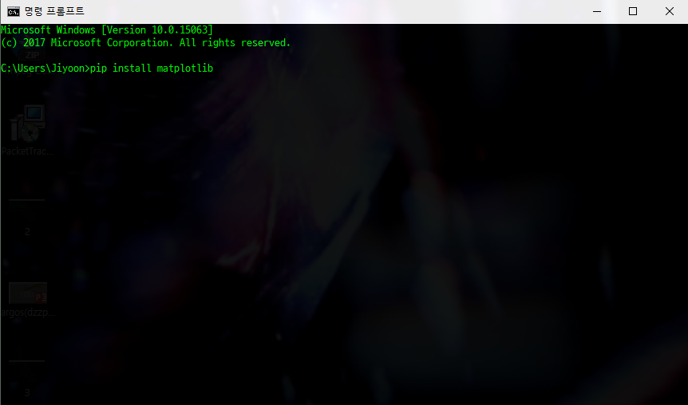</p>

  ​

- **h5py** : HDF5 바이너리 데이터 포맷의 형식을 저장하고 불러 올 수 있게하는 파이썬 라이브러리 입니다.
  ​            (튜토리얼에서 학습된 에이전트 모델을 저장하고 불러오는 역할을 합니다.)

  ```shell
  $ pip install h5py
  ```

  ​


### 6. 테스트 코드 실행

강의자료 dropbox에 01.Introduction_to_RL/setting_guide/testcode를 다운받아</br>
다음과 같이 파이참으로 실행합니다.
<p align="center">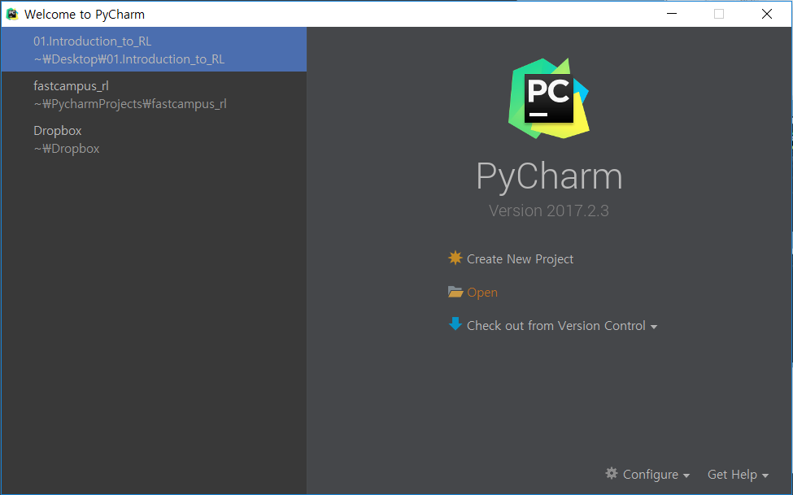</p>
<p align="center">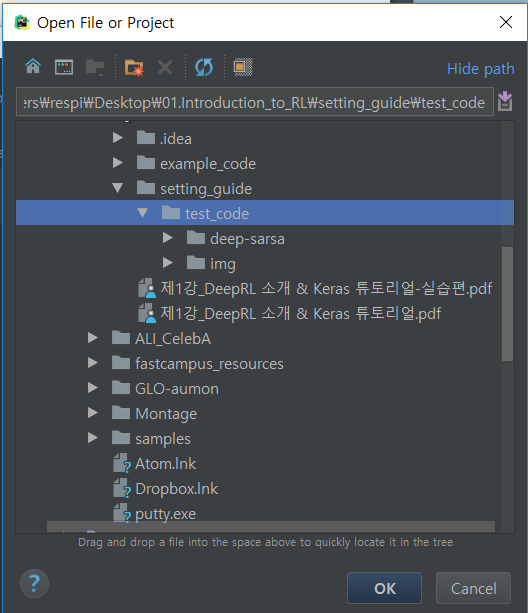</p>

파이참에서 deep_sarsa_agent.py 파일을 연 후 오른쪽 클릭 후 Run을 클릭해서 실행합니다.

<p align="center">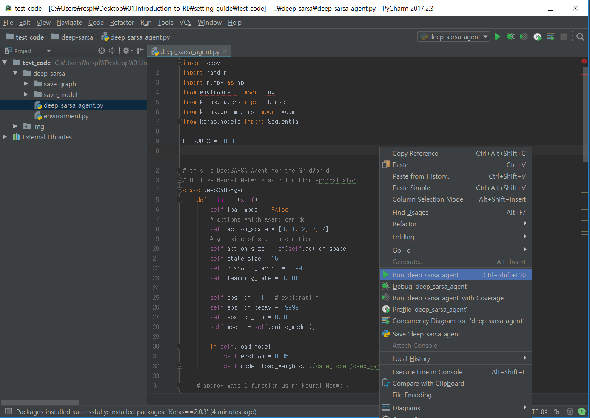</p>

또는, 터미널에서 해당 디렉토리에서 명령어를 통해 실행할 수 있습니다.

```shell
$ python deep_sarsa_agent.py
```

딥살사 실행화면 입니다.

<p align="center">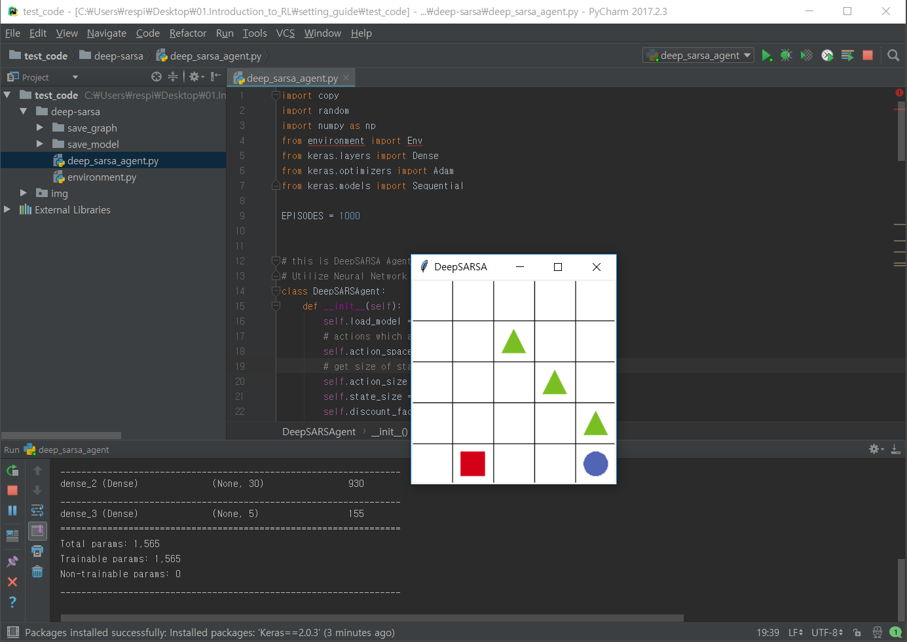</p>
